### Automatizando o ciclo de vida do software com OCI devops e funções OCI.
### Tempo estimado: 60 minutos (3 PARTES)
### LAB 1/3 – 30 minutos
### *Objetivos* 
-	Provisionamento de infraestrutura usando IaC e OCI Resource Manager.
-	Implatação de aplicativo python no OCI Functions.
-	Implantação com uso de funções padrões e customizadas do docker images. 

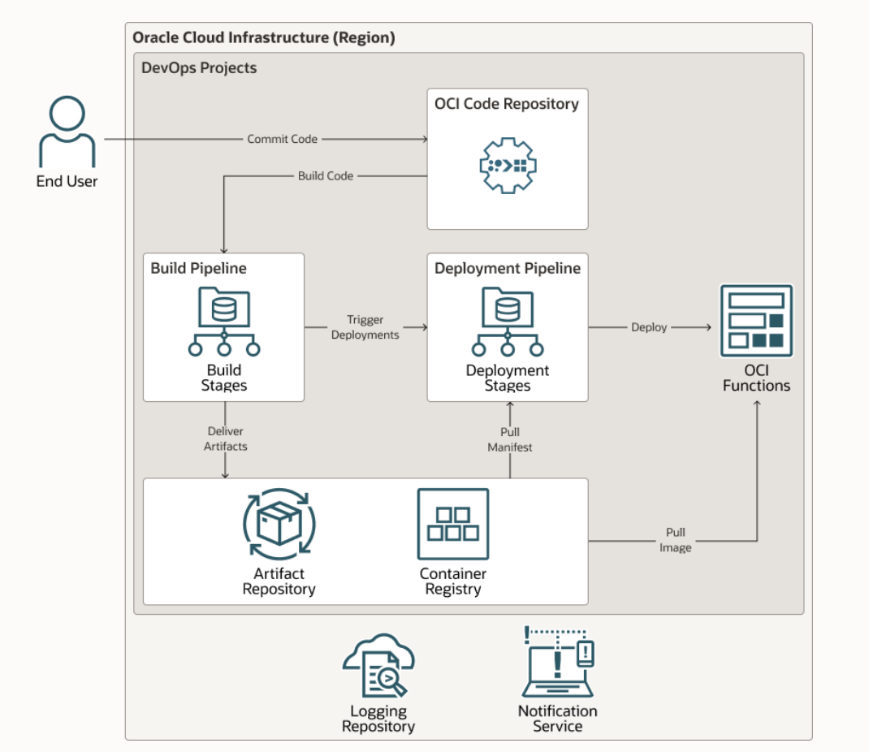

## *Parte 1 – provisionamento da infra*

### PASSO 1 – Criar o compartment
1.	Vá para o Menu de Navegação (também conhecido como menu "Hamburger" no canto superior esquerdo da página) -> Identidade e Segurança -> Identidade -> Compartimentos 
2.	Para criar um compartimento na tenancy (compartimento raiz), clique em Criar Compartimento. 
3.	Caso contrário, clique na hierarquia de compartimentos até chegar à página de detalhes do compartimento no qual deseja criar o compartimento. Na página Detalhes do Compartimento, clique em Criar Compartimento.

### PASSO 2 - Importar repositório Git "deploy"

1.	Abra uma nova guia do navegador e vá para o GitHub.

2.	Na barra de navegação superior, clique no sinal de mais -> Importar Repositório.

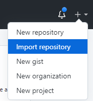
 

3.	Insira a URL do repositório DevOps da Arquitetura OCI
https://github.com/MarinaJacauna/oci-devops-with-functions 

4.	Insira um nome para o novo repositório de implantação. Para melhor identificá-lo, vamos nomeá-lo: oci-devops-with-functions

5.	Defina as configurações de privacidade para Privado e clique no botão Iniciar importação na parte inferior da página para criar um novo repositório.

6.	Abra a nova URL do repositório.

### PASSO 3 - Configurar o provedor de origem de configuração do ORM
Pre-requisito:
-	Gerar token de acesso pessoal do GitHub

1.	Recomendamos abrir uma nova janela/guia do navegador para manter a página do repositório aberta. Então, clique com o botão direito do mouse em Configurações e clique para abrir a página em uma nova guia ou janela.

2.	Vá para suas configurações de usuário. No canto superior direito da página do GitHub, clique na seta abaixo da sua foto de perfil.

3.	Na nova página, no menu do lado esquerdo, clique em Configurações do desenvolvedor (última opção).

4.	No menu do lado esquerdo, clique em Tokens de acesso pessoal (Personal access tokens).

5.	Clique em Gerar novo token. Para continuar, você pode ser solicitado a autenticar sua conta do GitHub, caso ainda não tenha feito isso.

6.	Insira uma nota para identificar melhor o token, por exemplo oci-deploy-orm .

7.	Em seguida, você deve definir a expiração do seu token, por exemplo. 30 dias.

8.	Por fim, na seção Selecionar escopos, você deve verificar apenas o escopo do repositório de nível superior que deve selecionar automaticamente suas dependências. Todos os escopos restantes devem ser deixados desmarcados. Isso permitirá que o ORM se integre a todos os seus repositórios.
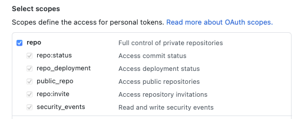

9.	Na parte inferior da página, você deve clicar em Gerar token

10.	Em seguida, copie o valor do token e armazene-o com segurança, pois o usaremos em breve e ele não será exibido novamente. Se você não conseguiu capturar ou perdeu seu token, você pode gerar um novo com segurança e atualizar suas configurações.

-	Criar um token de acesso do usuário

1.	Vá para OCI Console > Identidade e Segurança
2.	Clique em Usuários (abaixo do menu Identidade)
3.	Clique no nome do respectivo usuário OCI.
4.	No painel esquerdo, selecione Tokens de autenticação (Auth Tokens)
5.	Clique em Gerar Token.
6.	Dê uma descrição
7.	Clique em Gerar Token.
8.	Copie e salve o token com segurança.

- Criar provedor de origem de configuração ORM 
1.	Volte para sua OCI Tenancy e abra o serviço Resource Manager: Vá para Navigation Menu -> Developer Services -> Resource Manager
2.	No menu do lado esquerdo, clique em Configuration Source Providers. 
3.	Certifique-se de que o compartimento criado esteja selecionado na seção List Scope.
4.	Clique no botão Create Configuration Source Provider e preencha o formulário (coloque o nome do comparment criado lá no inicio) 
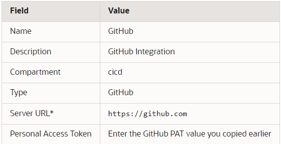
 
5.	Clique no botão Criar para finalizar este processo. Após a criação do provedor de origem de configuração, você pode clicar no hiperlink no nome do provedor para acessar a página Informações do provedor de origem de configuração.
6.	 Em seguida, clique no link Validar conexão ao lado da URL do servidor para garantir que o ORM tenha conectividade com o GitHub para buscar seus repositórios. 
Em caso de problemas com sua conexão, revise suas configurações. Se você não estiver usando uma conta gratuita do GitHub, talvez seja necessário alterar o URL. 
### PASSO 4 – Criar Stack do ORM
1.	Abra o serviço do Resource Manager. Você pode clicar diretamente no Resource Manager no menu do caminho de navegação, caso contrário, volte para o menu de navegação principal -> Developer Services -> Resource Manager.
2.	Na barra superior, clique em Criar pilha (stack). Certifique-se de que o compartimento criado esteja selecionado. 
3.	Na página de informações da etapa 1. Sistema de controle de origem (Source Code Control System) para a configuração Origem da configuração do Terraform.

 
4.	 Na seção Configuração da pilha, insira os seguintes dados:
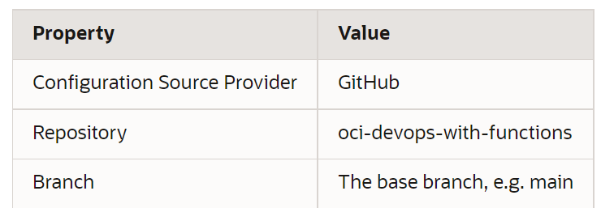
 
5.	Na seção Informações da pilha, insira:
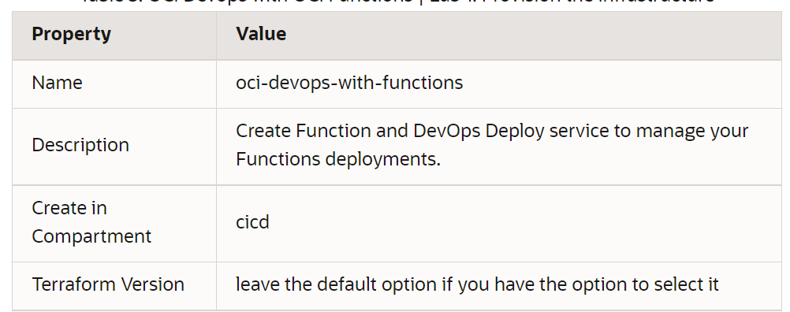
 
6.	Clique em Avançar na parte inferior da página para ir para 2. Configurar variáveis 
7.	Na página Configurar variáveis: 
    a.	Preencha o campo HelloWorldFn oci-function-cicd 
    b.	Defina o nome de usuário OCI com 'valores de nome de usuário' 
    c.	Certifique-se de usar o formato adequado de acordo. Por exemplo: valores de tenancy/nome de usuário ou provedor de identidade + nome de usuário etc. Certifique-se de que ambos
    d.	 Execute deployment in DevOps Pipeline? e Mostrar opções avançadas? estão desmarcados. 

8.	Configuração de rede: nenhuma alteração necessária, use os valores padrão
9.	Projeto Devops: Selecione o compartimento certo. Repositórios Git e OCI DevOps, fiquem com os valores padrão.
10.	 Devops Build Pipeline , sem necessidade de alterações. : crie um grupo dinâmico para pipelines de DevOps (marcado). 
11.	Clique em Avançar na parte inferior da página para prosseguir para a página 3.
12.	Revisão. Após revisar os valores das variáveis que foram modificados, clique no botão Criar para criar o Stack da infraestrutura integrada.

### PASSO 5 – Provisionar a infraestrutura

1.	Clique no botão Plan
2.	Altere o nome, caso deseje
3.	Quando o estado do trabalho for bem-sucedido (succeded), clique no menu de navegação Stack Details na parte superior da página para voltar à página anterior.
4.	Em seguida, clique em Aplicar (Apply) e insira um nome (por exemplo, apply1), 
5.	Essa operação levará algum tempo para ser concluída (15 a 20 minutos), pois fornecerá todos os recursos de infraestrutura necessários para este laboratório
6.	Enquanto o trabalho está em execução, você pode verificar os logs.
7.	Depois de finalizado, você pode clicar no menu Recursos do Trabalho para visualizar a lista de recursos de infraestrutura provisionados. Pode levar de 10 a 30 minutos para concluir.

Depois disso, se você quiser fazer alguma alteração nas variáveis, você pode voltar para a página de detalhes da pilha, clicar no botão Editar para alterá-las. Em seguida, você precisa executar os trabalhos Planejar e Aplicar para fazer essas alterações na infraestrutura. Sempre revise o plano de execução, pois alguns recursos são imutáveis e podem ser completamente destruídos e recriados pelo Terraform/ORM após clicar em Aplicar.

*Observação:* em caso de problemas de cota/limite de serviço/permissão, o trabalho de aplicação falhará e os recursos parciais serão provisionados. Clique no botão Destruir para acionar o trabalho para remover recursos provisionados.

### LAB 2/3 – 30 MINUTOS
*Objetivos*
-	Validar os componentes de devops da OCI.
-	Validar os componentes da função OCI.
-	Fazer uma compilação manual e uma execução de pipeline de implantação.
-	Usar a função manual e validar o resultado.

### PASSO 1 - Valide os componentes de devops da OCI.

1.	Vá para o Menu de Navegação (também conhecido como menu "Hamburger" no canto superior esquerdo da página) no OCI Console -> Developer Services
2.	Selecione Devops -> Projeto

 
3.	Na página Projeto, verifique se você está no compartimento certo
4.	Na mesma página, você deve ver um projeto chamado oci-function-cicd-<Unique Key>-devops-project, clique nele.
5.	Isso levará a um resumo de todos os recursos de devops que criamos.

 
6.	Clique no repositório chamado python-function-helloworld em Latest code repositories, que levará ao code repo e ao código python que será implantado nas funções.
7.	Acesse no menu esquerdo a opção ‘Files’ 
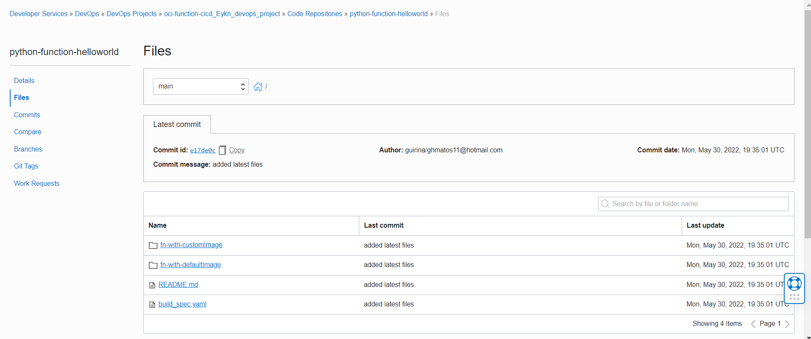
 
8.	Abra o arquivo build-spec.yaml para saber mais sobre as instruções de compilação.
9.	Volte para a página de visão geral do projeto, clique no Pipeline de compilação  (Build pipeline) mais recente chamado Function-Python-Buildpipeline. Ele abrirá o pipeline de compilação e mostrará os diferentes estágios.

 
Nosso pipeline de construção inclui 4 estágios
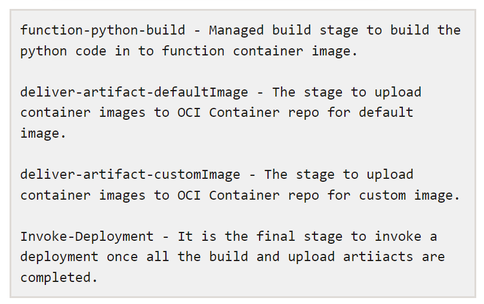
 
10.	Clique nos 3 pontos em cada um dos estágios e você poderá verificar os detalhes.

 
11.	Volte para a página de visão geral do projeto, clique no (Deployment pipelines) último pipeline de implantação chamado function-python-pipeline-<XXXX>. Ele abrirá o pipeline de implantação e mostrará os diferentes estágios
12.	Clique nos 3 pontos em cada etapa de implantação para saber mais sobre os detalhes
13.	Clique nas opções de Parâmetros na parte superior para ver os parâmetros que serão usados no estágio de implantação

 
O parâmetro BUILDRUN-HASH é o valor que será analisado do pipeline de compilação que será usado como uma tag de imagem do contêiner docker para o upload e a implantação de aplicativos.
14.	No menu lateral esquerdo, em Ambientes  mais recentes, clique em cada um dos ambientes e veja os detalhes.
15.	No menu lateral esquerdo, em Últimos artefatos (artifacts), clique em cada um dos artefatos 

 
Ele exibirá o caminho do registro de contêiner para o qual cada uma das imagens do docker será carregada. O caminho é pós-fixado com uma variável BUILDRUN-HASH. É preenchido dinamicamente a partir do pipeline de compilação e será usado como uma tag do docker.
16.	Volte para a página de visão geral do projeto, em Últimos gatilhos (triggers), clique em gatilhos
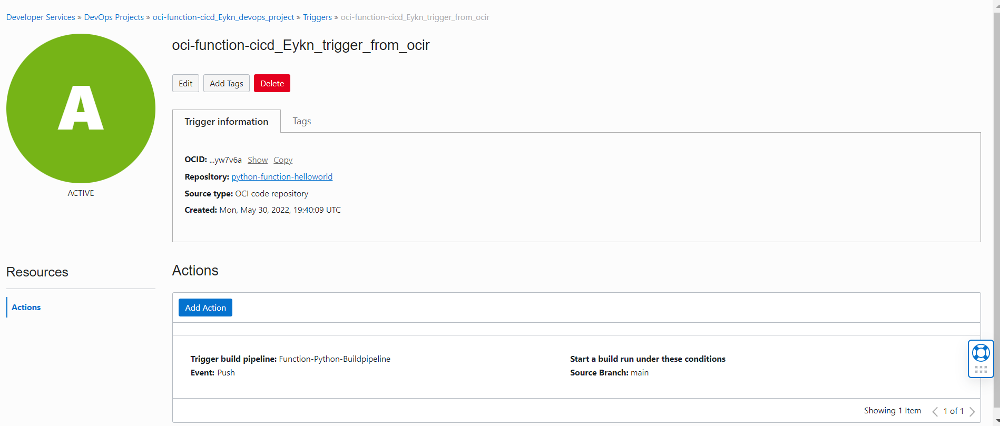
 
Os gatilhos nos permitirão acionar nosso pipeline de compilação automaticamente quando atualizarmos o repositório de código OCI devops.
### PASSO 2 – Validar  os componetes do OCI Functions

1.	Vá para o Menu de Navegação (também conhecido como menu "Hamburger" no canto superior esquerdo da página) no OCI Console -> Developer Services
2.	Selecione Devops -> Projeto
3.	Na página Projeto, verifique se você está no compartimento certo
4.	Na mesma página, você deve ver um projeto chamado oci-function-cicd-<Unique Key>-devops-project
5.	Clique no pipeline de compilação mais recente chamado Function-Python-Buildpipeline. Ele abrirá o pipeline de compilação e mostrará os diferentes estágios.
6.	No canto superior direito, clique em Iniciar execução manual

 
7.	Forneça um nome para a execução de amostra de execução manual e clique em Iniciar execução manual.
8.	Siga as ações de execução de compilação até sua conclusão
9.	Valide se o estágio de compilação gerenciada foi concluído expandindo o estágio. 
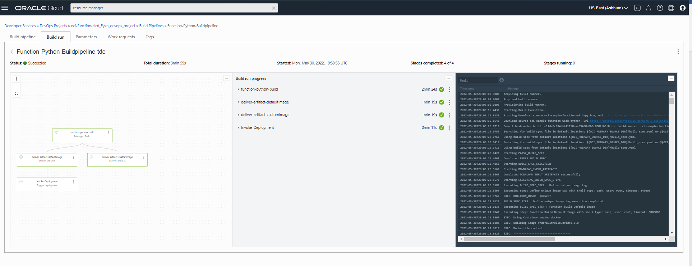
 
10.	Verifique se ambas as etapas de upload de artefatos foram concluídas. São etapas paralelas que enviarão as imagens do contêiner para o Oracle Container Repo.
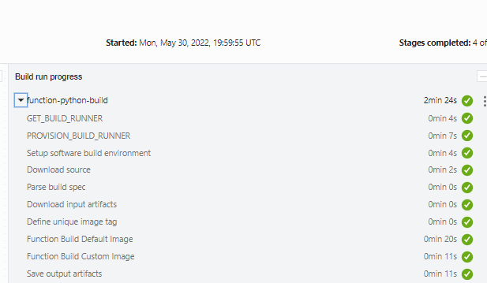
 
11.	As últimas etapas de compilação serão invocar o pipeline de implantação e garantir sua conclusão.

 
12.	Volte para a página de visão geral do projeto, selecione Deployments from DevOps project resources.
13.	Clique na implantação mais recente para obter detalhes do estágio. Se os estágios em andamento, aguarde até a conclusão e verifique se todas as etapas foram concluídas . 

### PASSO 4 – Use a função manualmente e valide os resultados

1.	Vá para o Menu de Navegação (também conhecido como menu "Hamburger" no canto superior esquerdo da página) no OCI Console -> Developer Services
2.	Selecione Aplicativos no menu Funções.
3.	Clique no nome do aplicativo e isso fornecerá os detalhes sobre nossas funções de destino. Certifique-se sempre de estar no compartimento certo.
4.	Na guia Recursos, selecione Logs e verifique se está ativado
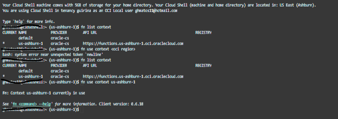
 
5.	Na guia Recursos, selecione a opção Introdução (Getting started).
6.	Clique no botão Iniciar Cloud Shell (Launch Cloud Shell).
7.	Siga as primeiras 3 etapas em Setup fn CLI no Cloud Shell. Você pode copiar e colar no Cloud Shell.
8.	Definir contexto da lista fn
    - fn list context
    - fn use context <oci region>

 

9.	Atualize o contexto com o ID do compartimento da função
    - fn update context oracle.compartment-id ocid1.compartment.oc1..<id>
10.	Valide se o contexto do aplicativo está configurado corretamente e exiba as funções.
    - fn list apps
    - fn list functions *<nome da aplicacao>*  
*oci-function-cicdApp  - nome da aplicação
11.	Verifique se duas funções nomeadas como oci-function-cicd-customImage e oci-function-cicd-defaultImage estão listadas
12.	Invoque a função oci-function-cicd-defaultImage
    - fn invoke oci-function-cicdApp oci-function-cicd-defaultImage
Após alguns segundos, o console deve mostrar uma saída json como abaixo.

 
13.	Invoque a função oci-function-cicd-customImage
    - fn invoke oci-function-cicdApp oci-function-cicd-customImage
Após alguns segundos, o console deve mostrar uma saída json como abaixo.

 
14.	Volte ao console OCI. Na guia Recursos, selecione Logs
15.	Clique no nome do log como oci-function-cicd-<xxxx>-fnInvokeLog.
16.	Altere a opção Filtrar por tempo para 15 minutos (ou mais).
17.	Expanda as entradas de dados de log e verifique as mensagens

 

### LAB 3/3 –  10 minutos (opcional)
É recomendado liberar os recursos criados para não consumir créditos da sua conta de teste

### PASSO 1  - Liberando recursos do ORM 

1.	Abra o menu de navegação e clique em Developer Services. Em Gerenciador de Recursos, clique em Pilhas (Stack).
2.	Escolha o compartimento usado se você não tiver selecionado antes. A página é atualizada para exibir apenas os recursos nesse compartimento.
3.	Clique no nome da pilha oci-devops-functions.
4.	A página Detalhes da pilha é exibida.
5.	Clique em Destruir (Destroy)
6.	No painel Destruir, você pode inserir um nome para o trabalho e clicar em Destruir novamente para confirmar sua ação. Você pode monitorar o status e revisar os resultados de uma tarefa de destruição visualizando o estado ou os logs.
7.	Para visualizar o arquivo de estado do Terraform (mostra o estado de seus recursos após a execução da tarefa), clique no nome da tarefa para exibir a página Detalhes da tarefa e clique em Exibir estado em Recursos.
8.	Para visualizar os logs do trabalho, clique no nome do trabalho para exibir a página Detalhes do trabalho e clique em Logs em Recursos.
9.	No final, a tarefa Destruir é bem-sucedida e seus recursos foram liberados.
10.	Você pode voltar para a página Detalhes da pilha e excluir a pilha clicando em Mais ações -> Excluir pilha e clique novamente para confirmar sua ação.

### PASSO 2: Excluir provedor de origem de configuração do ORM

1.	A próxima etapa é excluir o GitHub Configuration Source Provider no Oracle Resource Manager.
2.	No menu do lado esquerdo, em Resource Manager, clique em Configuration Source Providers.
3.	Clique no nome do provedor de origem de configuração que você deseja excluir - GitHub.
4.	Clique em Excluir provedor de origem de configuração e confirme a ação.

### PASSO 3 - Valide os recursos de tenacy e exclua os recursos restantes.

1.	Idealmente, uma vez concluídas as tarefas acima, deve-se limpar os recursos dentro do compartimento cicd. Mas não limpará nada se houver alguns recursos criados fora do laboratório.

2.	Use a barra de pesquisa no meio do console OCI e digite Tenancy Explorer selecione na lista suspensa.

3.	Na lista de compartimentos, selecione o compartimento usado e você deverá ver alguns dos trabalhos de execução de construção, implantações e gerenciador de recursos.

4.	Valide os recursos e se eles estão associados ao laboratório e se eles são do tipo acima mencionado você pode ignorá-los com segurança

5.	Agora você pode excluir o compartimento usado. Esta é uma etapa opcional e excluir o compartimento quando tiver certeza de que ele não é usado para outros recursos ou operações. Use a pesquisa do console OCI e selecione compartimentos
