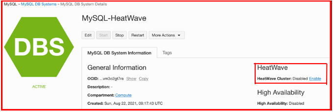
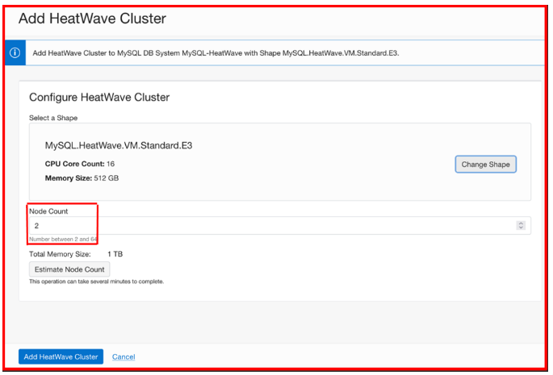
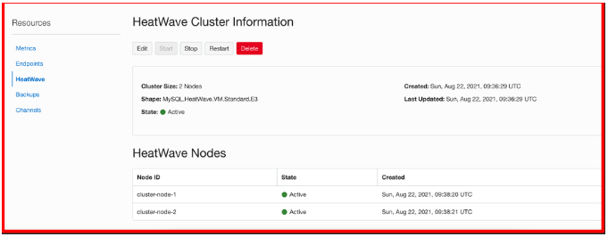
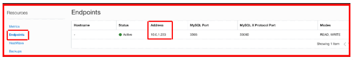

## Ative o cluster HeatWave no sistema de banco de dados MySQL

Neste laboratório você habilitará o HeatWave Cluster no MySQL Database System que criamos no Laboratório 1.

### 1. Ativando o cluster HeatWave no sistema de banco de dados MySQL

Navegue até o MySQL DB System na seção Database e você verá o MySQL DB System recém-criado no estado ativo. Agora clique no sistema de banco de dados e você verá que o HeatWave está desativado. Agora, para ativar o mecanismo HeatWave, clique em Ativar.

Selecione o nó e clique em “Add HeatWave Cluster”

Agora para ver o processo de criação, navegue até a seção “Resource” e selecione a opção “HeatWave” para ver o status do nó do cluster. Você verá o nó do CLuster como 'Ativo'

Agora, na seção de recursos, clique na seção “Endpoint” e anote o endereço IP. Este endereço IP será usado para se conectar ao MySQL Database System.

**Nota:** Nesta fase temos nosso MySQL Database System Ativo e o HeatWave Cluster também está habilitado.

[Retornar para o Lab1](https://github.com/CeInnovationTeam/Labs-TDC/tree/main/Lab.%20%235%20-%20Heatwave/LAB1)

[Avançar para o LAb3](https://github.com/CeInnovationTeam/Labs-TDC/tree/main/Lab.%20%235%20-%20Heatwave/LAB3)

