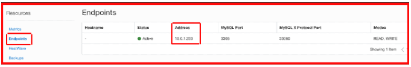
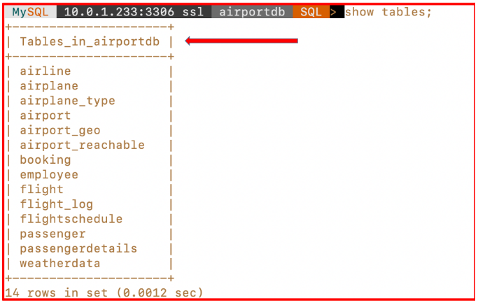
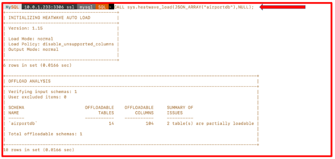

## Carregue os dados no MySQL HeatWave Cluster Engine

Este laboratório orientará você nas etapas para fazer upload de dados no HeatWave Cluster no MySQL Database System que habilitamos no Laboratório 2.

## 1. Acesse a VM

O primeiro passo é acessar a VM, para fazer isso basta abrir o Git Bash e digitar o seguinte comando:

`ssh -i <chave-privada> opc@<IP-Publico>`

Instale o MySQL Shell:

`sudo yum install mysql-shell`

Uma vez que já habilitamos o MySQL HeatWave Cluster Database System e anotamos o endereço IP do Endpoint do nosso MySQL Database System.

você pode executar diretamente o comando `wget https://downloads.mysql.com/docs/airport-db.tar.gz` para baixar o arquivo “airport-db.tar.gz” no local especificado.

Agora descompacte o arquivo “airport-db.tar.gz” executando o comando `tar -xf airport-db.tar.gz` da sua máquina Compuete onde você baixou este arquivo.

`tar -xf airport-db.tar.gz`

Agora faça login no banco de dados MySQL usando o MySQL Shell e conecte-se ao sistema de banco de dados MySQL usando o Endpoint.

`mysqlsh root@10.0.1.233`

Agora carregue os dados no MySQL Database System usando o comando util.loadDump.

`util.loadDump("airport-db", {threads: 16, loadIndexes: "false", ignoreVersion: true,resetProgress: true})`

Depois que os dados forem carregados, você poderá verificar o banco de dados e as tabelas.

`use airportdb;
show tables;`

**NOTA:** Neste estágio temos o banco de dados “airportdb” no MySQL Database System e agora precisamos carregar o banco de dados “airportdb” no cluster HeatWave.

Agora, para carregar o banco de dados "airportdb" no HeatWave Cluseter, execute o comando abaixo do MySQL Shell.

`use mysql;
CALL sys.heatwave_load(JSON_ARRAY("airportdb"),NULL);`

Após a execução bem-sucedida do código acima, você verá o carregamento de dados.

Agora você pode prosseguir para o próximo laboratório.

[Retornar para o LAB3](https://github.com/CeInnovationTeam/Labs-TDC/tree/main/Lab.%20%234%20-%20Heatwave/LAB3)

[Avançar para o LAB5](https://github.com/CeInnovationTeam/Labs-TDC/tree/main/Lab.%20%234%20-%20Heatwave/LAB5)

