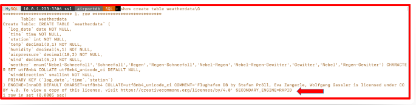
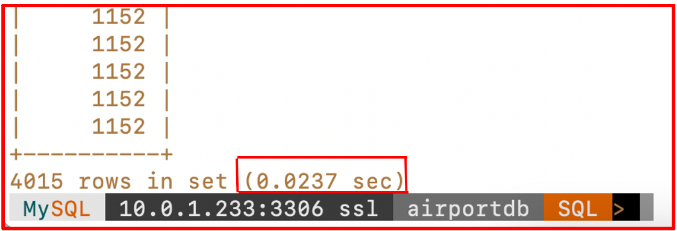
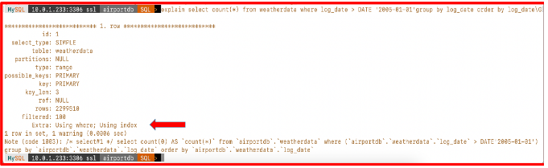
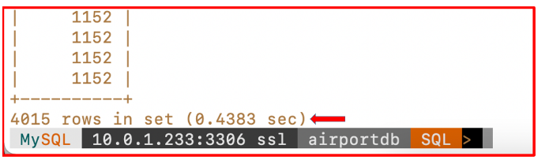

## Execute a consulta SQL para visualizar as diferenças de desempenho

Este laboratório irá ajudá-lo a experimentar a diferença de desempenho no MySQL HeatWave Cluster executando SQL Query.

### 1. Execute a consulta SQL para ver as diferenças de desempenho

Agora temos o banco de dados airportdb carregado no mecanismo HeatWave Cluster. Executaremos a consulta em uma das tabelas denominada tabela weatherdata para ver a diferença no tempo de execução. Como a tabela já está carregada no HeatWave Cluster. Você pode vê-lo na definição da tabela.

`use airportdb;
show create table weatherdata\G`

Vamos executar a consulta SQL abaixo e verificar primeiro no plano de explicação que essa consulta está usando o mecanismo HeatWave (mecanismo secundário) “Rapid”, que é nosso mecanismo clsuetr HeatWave.

`Explain select count(*) from weatherdata where log_date > DATE '2005-01-01'group by log_date order by log_date\G`

Agora execute a consulta para ver o tempo de execução.

`select count(*) from weatherdata where log_date > DATE '2005-01-01'group by log_date order by log_date;`

Agora, da execução acima, podemos ver que a consulta levou aprox. 0,0237 segundos para concluir. E para comparar o tempo de execução da consulta HeatWave com o tempo de execução normal do MySQL DB System, vou desabilitar a variável usesecondaryengine e executar a consulta novamente para ver quanto tempo leva para executar no MySQL DB System e NÃO usando o HeatWave Cluster.

**NOTA:** Quando você desabilita o use_secondary_engine e executa a consulta, a referida consulta não usará o mecanismo HeatWave.

Para verificar o mesmo, executaremos novamente o comando Explain para ver que a consulta está usando o mecanismo MySQL normal e não o mecanismo HeatWave Cluster.

`Explain select count(*) from weatherdata where log_date > DATE '2005-01-01'group by log_date order by log_date\G`

Agora execute a consulta SQL para ver o tempo de execução real para que possamos comparar a diferença no tempo de execução.

`select count(*) from weatherdata where log_date > DATE '2005-01-01'group by log_date order by log_date;`

**Nota:** Como podemos ver a diferença de tempo no tempo de execução no Normal MySQL Database System, a mesma consulta levou aprox. 0,4383 segundos No entanto, a mesma consulta levou 0,0237 ao ser executada com o HeatWave Cluster habilitado.

Conclusão: Como você experimentou, o HeatWave Engine acelera o desempenho do MySQL para consultas usando o HeatWave Engine. O HeatWave pode melhorar o desempenho em 5.400 vezes para consultas de análise, escala horizontalmente para milhares de núcleos e é 6,5 vezes mais rápido pela metade do custo do Amazon Redshift AQUA. O MySQL Database Service, com HeatWave, é o único serviço para executar cargas de trabalho OLTP e OLAP diretamente de seu banco de dados MySQL.

Espero que tenha gostado deste laboratório 

