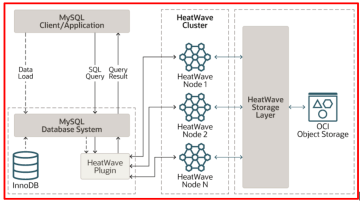

# Heatwave

Este desafio basicamente o guiará pelos estágios em que você estará rodando um MySQL Database System com HeatWave Cluster no Oracle Cloud e experimentará como o mecanismo HeatWave aumenta o desempenho em comparação com o MySQL normal ao executar consultas analíticas ou outras consultas que usam o mecanismo HeatWave para processar.

## Sobre o HeatWave
O HeatWave é um mecanismo de processamento de consultas distribuído, escalável, sem compartilhamento, na memória, colunar híbrido, projetado para desempenho extremo. Ele é ativado quando você adiciona um cluster HeatWave a um sistema de banco de dados MySQL. Para saber mais sobre o HeatWave Cluster [clique aqui](https://dev.mysql.com/doc/heatwave/en/heatwave-introduction.html)

##  Arquitetura HeatWave

[Desafio 1 - Crie o MySQL Database System na Oracle Cloud](https://github.com/CeInnovationTeam/Labs-TDC/tree/main/Lab.%20%234%20-%20Heatwave/LAB1)