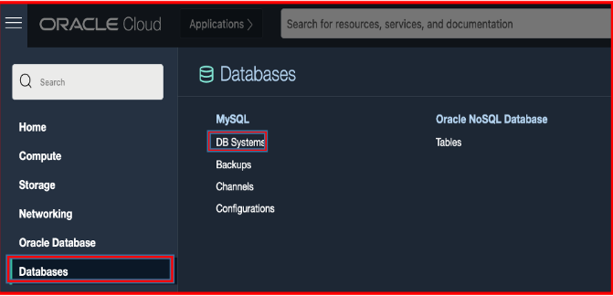
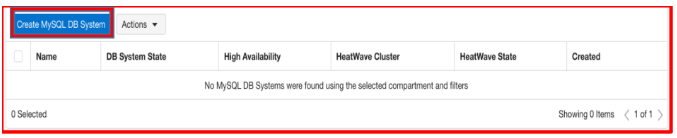
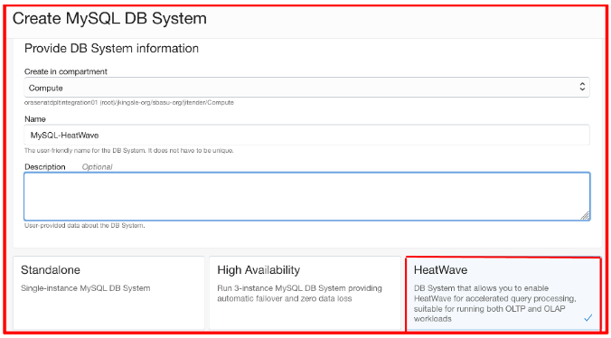
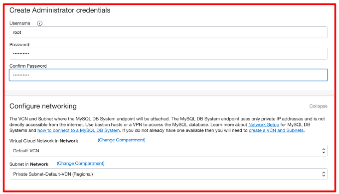
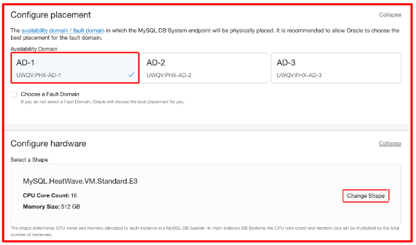
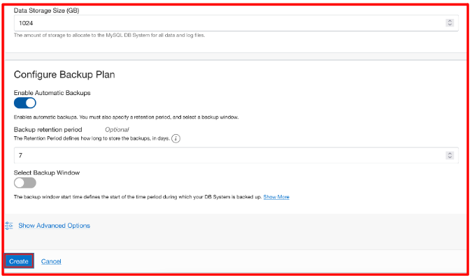
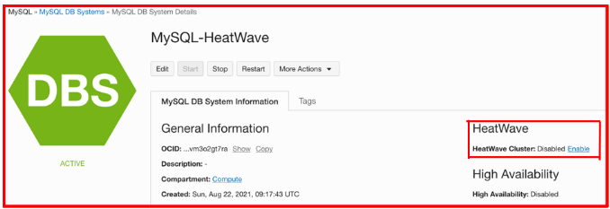

Neste laboratório você aprenderá a:
 - Provisionar o sistema de banco de dados MySQL no Oracle Cloud
 - Habilitar o cluster HeatWave no banco de dados MySQL
 - Carregar dados de amostra no cluster HeatWave
 - Executar consultas SQL para ver a diferença de desempenho e tempo de execução

## 1. Criando o  MySQL Database System na Oracle Cloud

Faça login no console OCI, navegue até o menu Databases e clique em DB Systems no MySQL.

Clique em "Create MySQL DB System"

Selecione Compartimento e logo em seguida selecione “HeatWave” nas opções.

Forneça nome de usuário/senha, confirme a senha e selecione Virtual Cloud Network (VCN)

Selecione Domínio de Disponibilidade conforme sua escolha e selecione “MySQL.HeatWave.VM.Standard.E3”. Se você deseja alterar a forma da instância, clique no botão “Alterar forma”.

Especifique o tamanho do armazenamento e habilite backups automatizados e clique em “Criar” para iniciar o processo de criação.

Depois que a instância for iniciada, ela ficará ativa em alguns minutos. No entanto, as opções do HeatWave serão desabilitadas.

**Nota**: Nesta fase, aprendemos como criar o MySQL Database System. No entanto, o HeatWave Engine ainda está desabilitado. Para habilitar o mecanismo HeatWave, prosseguiremos para o próximo laboratório.

[Retornar](https://github.com/CeInnovationTeam/Labs-TDC/tree/main/Lab.%20%235%20-%20Heatwave)

