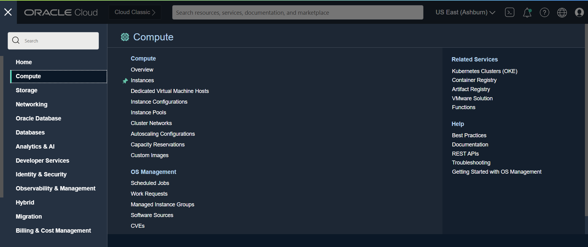
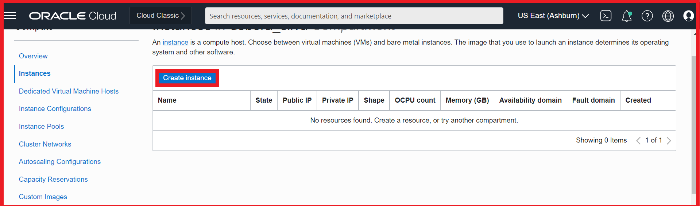
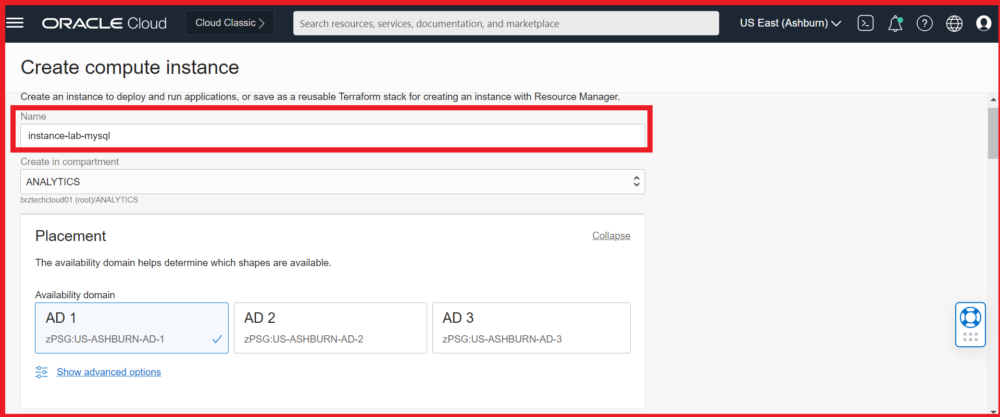
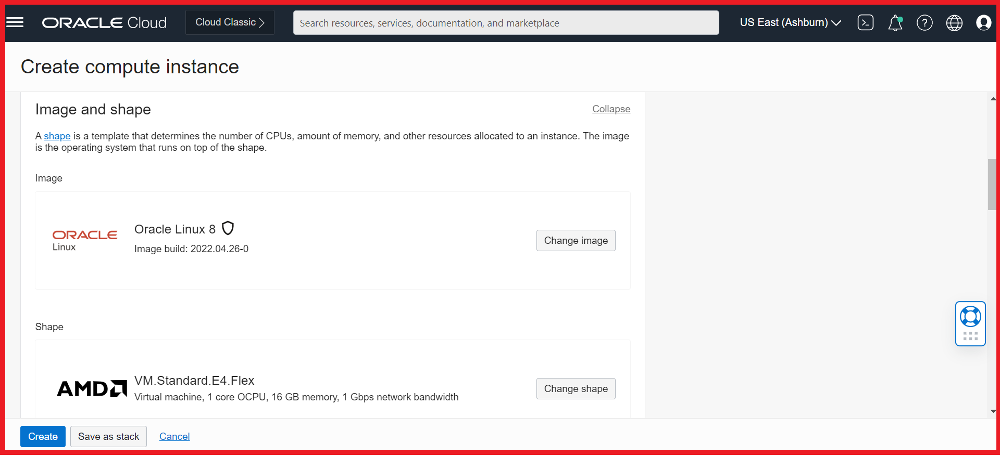
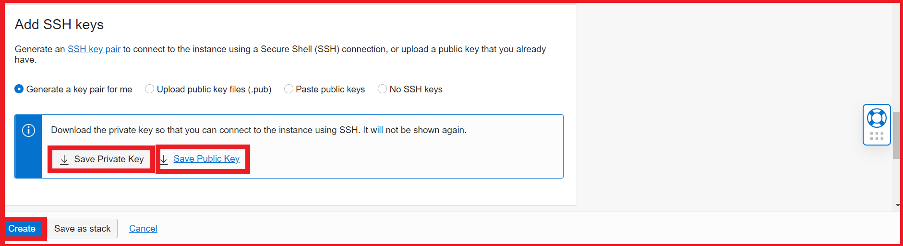
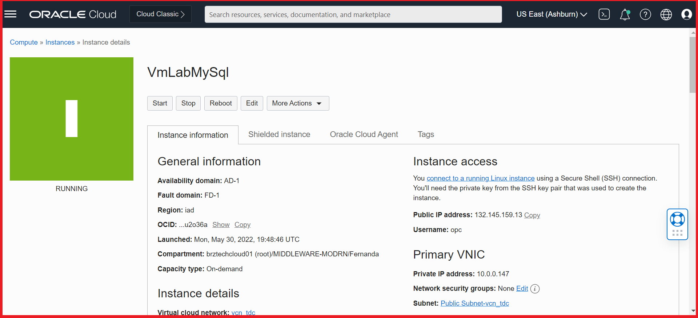

## Criando uma VM para acessar o MySQL

Faça login no console OCI, navegue até o menu Compute e clique em Instances.

Clique em "Create Instance"

Escolha um nome para sua VM e Selecione o Compartment

A imagem e o Shape pode deixar o recomendado

Em seguida salve as chaves SShs Privadas e Públicas e clique em Create

Dentro de alguns minutos você deve ter sua VM ativa

