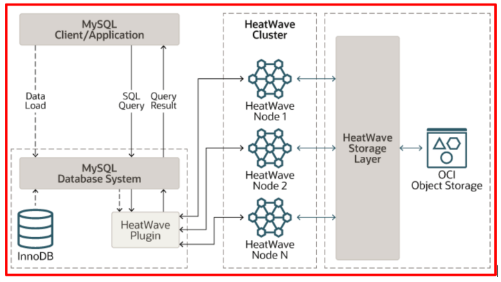
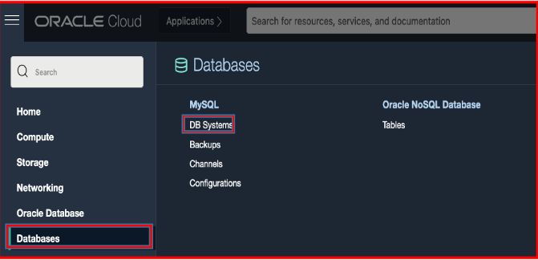
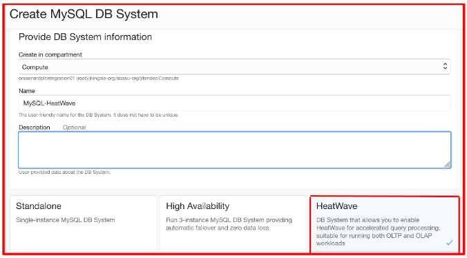
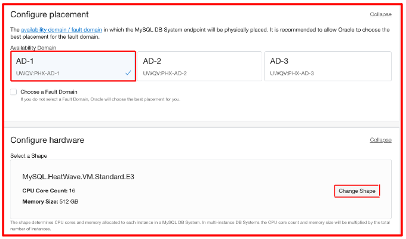

# Heatwave

Este workshop basicamente o guiará pelos estágios em que você estará rodando um MySQL Database System com HeatWave Cluster no Oracle Cloud e experimentará como o mecanismo HeatWave aumenta o desempenho em comparação com o MySQL normal ao executar consultas analíticas ou outras consultas que usam o mecanismo HeatWave para processar.

## Sobre o HeatWave
O HeatWave é um mecanismo de processamento de consultas distribuído, escalável, sem compartilhamento, na memória, colunar híbrido, projetado para desempenho extremo. Ele é ativado quando você adiciona um cluster HeatWave a um sistema de banco de dados MySQL. Para saber mais sobre o HeatWave Cluster [clique aqui](https://dev.mysql.com/doc/heatwave/en/heatwave-introduction.html)

##  Arquitetura HeatWave

Neste laboratório você aprenderá a:
 - Provisionar o sistema de banco de dados MySQL no Oracle Cloud
 - Habilitar o cluster HeatWave no banco de dados MySQL
 - Carregar dados de amostra no cluster HeatWave
 - Executar consultas SQL para ver a diferença de desempenho e tempo de execução

## 1. Criando o  MySQL Database System na Oracle Cloud

Faça login no console OCI, navegue até o menu Databases e clique em DB Systems no MySQL.

Clique em "Create MySQL DB System"

Selecione Compartimento e logo em seguida selecione “HeatWave” nas opções.

Forneça nome de usuário/senha, confirme a senha e selecione Virtual Cloud Network (VCN)

Selecione Domínio de Disponibilidade conforme sua escolha e selecione “MySQL.HeatWave.VM.Standard.E3”. Se você deseja alterar a forma da instância, clique no botão “Alterar forma”.

Especifique o tamanho do armazenamento e habilite backups automatizados e clique em “Criar” para iniciar o processo de criação.

Depois que a instância for iniciada, ela ficará ativa em alguns minutos. No entanto, as opções do HeatWave serão desabilitadas.

**Nota**: Nota: Nesta fase, aprendemos como criar o MySQL Database System. No entanto, o HeatWave Engine ainda está desabilitado. Para habilitar o mecanismo HeatWave, prosseguiremos para a próxima tarefa.

## 2. Ativando o cluster HeatWave no sistema de banco de dados MySQL