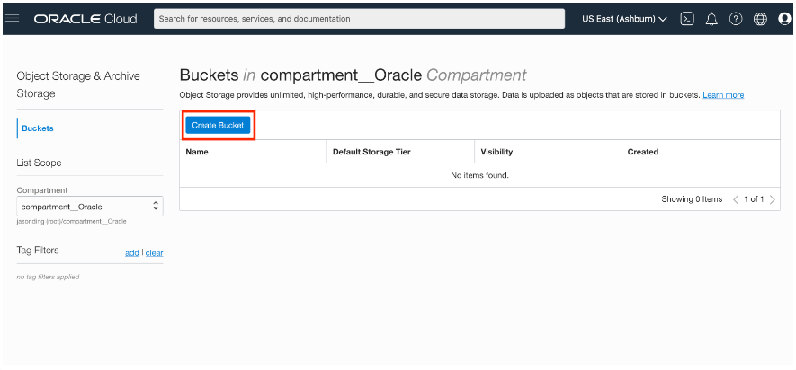
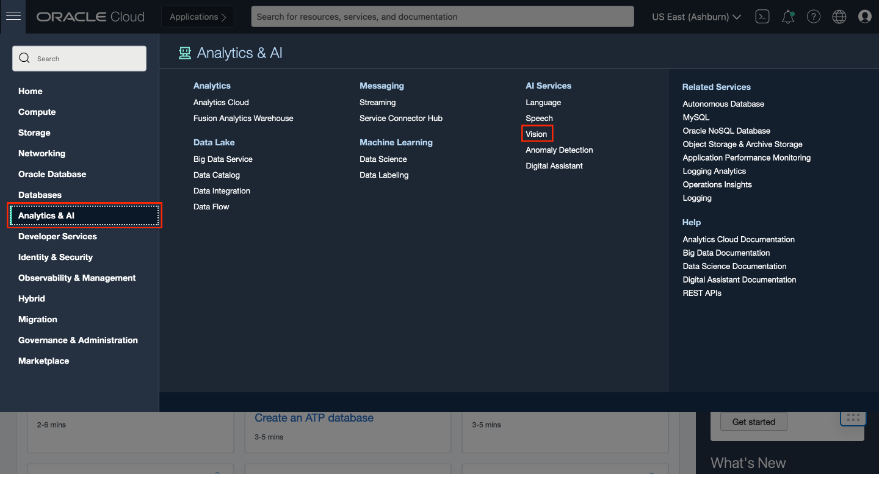

# Vision
O Vision é Serverless, Multitenant e acessível usando o Console ou por meio de API Rest.
Ele permite que você carregue imagens para detectar e classificar objetos nelas. Se você tiver muitas imagens, poderá processá-las em lote por meio de endpoints de API assíncronos.
Os recursos do serviço Vision são divididos tematicamente entre:
- Document AI(para imagens centradas em documentos)
- Image Analysis(para imagens baseadas em objetos e cenas)

## Objetivos do laborátorio:

 - Deixar você familiarizado com a console do OCI e capaz de demonstrar os principais recursos do Vision
 - Fazer com que você saiba treinar uma classificação de imagem ou modelo de detecção de objetos por meio da console do OCI.

 ### 1. Carregamento dos dados para o Object Storage

 ### Criar um Bucket no Object Storage

 Primeiro, no menu OCI Services, clique em Object Storage.

 

Em seguida, selecione Compartimento no menu suspenso à esquerda. Escolha o compartimento que corresponde ao seu nome ou nome da empresa.

Em seguida, clique em Criar bucket.

Em seguida, preencha a caixa de diálogo:
    - Nome do bucket: forneça um nome
    - Camada de armazenamento: PADRÃO
Em seguida, clique em Criar

### 2. Carregar arquivos de imagem no bucket de armazenamento

 - clique no nome do bucket
 - A janela de detalhes deve estar visível. Clique em Carregar

 

 Clique em Carregar e navegue até o arquivo que você deseja carregar.

 ##  Demo Vision Service using the OCI Console

 Navegue até a página do Vision do console OCI

#### 3. Use os recursos do Document AI

Na página do Vision, selecione “Document AI” no menu de navegação à esquerda e forneça um documento ou imagem do armazenamento local ou armazenamento de objetos OCI. Isso invoca a API analyzeDocument depois que a imagem é fornecida. O texto bruto extraído pelo nosso modelo multi-tenant pré-treinado é exibido à direita.

#### Recursos que você pode testar:

Recurso | Descrição | Detalhes no Console
:-------: | :--------: | :-----------------:
OCR (reconhecimento óptico de caracteres) | Localiza e digitaliza informações de texto de imagens | O texto aparecerá sob o cabeçalho "texto bruto" do painel de resultados do console [Referência](https://oracle.github.io/learning-library/oci-library/oci-hol/oci-artificial-intelligence/ai-vision/analyze-vision/images/ocr.png)
Classificação da imagem do documento | Classifica documentos em diferentes tipos com base em sua aparência visual, recursos de alto nível e palavras-chave extraídas | A classificação junto com a pontuação de confiança aparece diretamente no painel "Resultados" [Referência](https://oracle.github.io/learning-library/oci-library/oci-hol/oci-artificial-intelligence/ai-vision/analyze-vision/images/dic.png)
Classificação do idioma | Classifica o idioma do documento com base em recursos visuais | A classificação junto com a pontuação de confiança aparece na classificação do documento no painel Resultados [Referência](https://oracle.github.io/learning-library/oci-library/oci-hol/oci-artificial-intelligence/ai-vision/analyze-vision/images/language-classification.png)
Extração de tabela | Extrai conteúdo em formato tabular, mantendo as relações linha/coluna das células | Alterne para a guia Tabela para obter informações da tabela [Referência](https://oracle.github.io/learning-library/oci-library/oci-hol/oci-artificial-intelligence/ai-vision/analyze-vision/images/table-extraction.png)
Saída PDF pesquisável | Incorpora uma camada transparente em cima da imagem do documento em formato PDF para torná-lo pesquisável por palavras-chave | Você precisa testar em um documento PDF para usar esse recurso. Quando você selecionar um PDF, o botão PDF pesquisável poderá ser clicado. Clicar nele fará o download de um PDF OCR para o seu computador. [Referência](https://oracle.github.io/learning-library/oci-library/oci-hol/oci-artificial-intelligence/ai-vision/analyze-vision/images/searchable-pdf-output.png)

### 4 . Usar recursos de análise de imagem

Na página do Vision, selecione "Classificação de imagem" ou "Detecção de objeto" no menu de navegação à esquerda e forneça uma imagem do armazenamento local ou do armazenamento de objetos OCI. Isso invoca a API analyzeImage depois que a imagem é fornecida.

Recursos que você pode testar:

Recurso | Descrição | Detalhes no Console
:-------: | :--------: | :-----------------:
Classificação de imagem | Categoriza objetos em uma imagem | Selecione "Classificação de imagem". Rótulos e pontuações de confiança aparecerão no painel Resultados. [Referência](https://oracle.github.io/learning-library/oci-library/oci-hol/oci-artificial-intelligence/ai-vision/analyze-vision/images/image-classification.png)
Detecção de objetos | Localiza e identifica objetos dentro de uma imagem | Selecione "Detecção de Objetos". Objetos, pontuação de confiança e caixa delimitadora realçada aparecerão no painel Resultados. Clicar em um dos rótulos no painel de resultados também destacará onde na imagem o objeto foi detectado. [Referência](https://oracle.github.io/learning-library/oci-library/oci-hol/oci-artificial-intelligence/ai-vision/analyze-vision/images/object-detection.png)

## Parabéns por concluir este laboratório!

